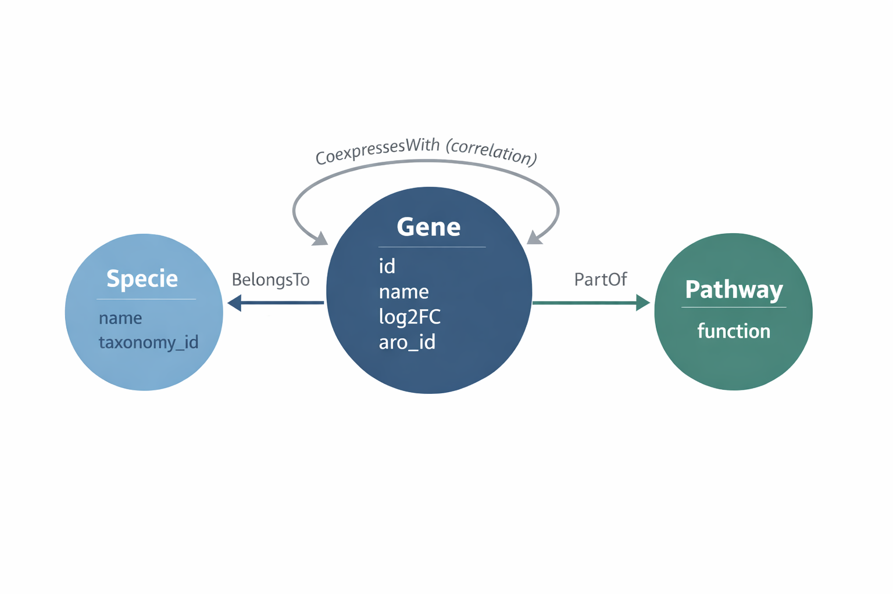

# Projeto `Atlas da Resistência: Análise Comparativa de Redes de Coexpressão Transcriptômica em Patógenos ESKAPE sob Estresse por Carbapenêmicos`

# Project `The Resistance Atlas: Comparative Analysis of Transcriptomic Co-expression Networks in ESKAPE Pathogens under Carbapenem Stress`

# Descrição Resumida do Projeto

O projeto Atlas da Resistência investiga a resposta adaptativa de patógenos do grupo ESKAPE, especificamente *Klebsiella pneumoniae*, *Acinetobacter baumannii* e *Pseudomonas aeruginosa*, quando submetidos ao estresse pelo antibiótico Meropenem. A motivação central reside no fato de que a resistência antimicrobiana não é um evento isolado de um único gene, mas uma propriedade emergente de sistemas biológicos complexos que se organizam para garantir a sobrevivência bacteriana. No contexto clínico atual, essas três bactérias representam as ameaças mais críticas em ambientes hospitalares devido à sua capacidade de "escapar" da ação de carbapenêmicos, que são frequentemente a última linha de defesa terapêutica. O problema abordado pelo projeto é a falta de uma visão sistêmica e comparativa que identifique se diferentes espécies utilizam uma arquitetura de rede comum para resistir ao mesmo fármaco. Utilizando dados de transcriptoma (RNA-Seq) obtidos de bases públicas, o trabalho emprega a Ciência de Redes para transformar níveis de expressão gênica em grafos de coexpressão, onde os genes atuam como nós e suas correlações funcionais como arestas. O objetivo final é realizar uma análise visual e topológica para identificar genes-hub e módulos de resistência conservados, permitindo determinar se existe um "core" transcriptômico universal que possa ser explorado como alvo para novas estratégias de tratamento que ignorem as fronteiras entre espécies.

# Slides

- [Link do google slides](https://docs.google.com/presentation/d/1zOGQ5nJoz8DNAa526JGh_O6kWnHknH2vmegufPo-zCw/edit?usp=sharing)
- [View slides as PDF](./assets/slides/atlas_resistencia.pdf)

# Fundamentação Teórica

A crise global da resistência antimicrobiana (RAM) consolidou-se como um dos maiores desafios da medicina contemporânea, sendo personificada pelo grupo de patógenos denominado ESKAPE (*Enterococcus faecium, Staphylococcus aureus, Klebsiella pneumoniae, Acinetobacter baumannii, Pseudomonas aeruginosa* e *Enterobacter* spp.). Como destacado por Boucher et al. (2009) [^1], o termo "ESKAPE" não se refere apenas à patogenicidade desses microrganismos, mas à sua capacidade intrínseca e adquirida de "escapar" da ação de antibióticos convencionais, limitando drasticamente as opções terapêuticas disponíveis. No topo desta lista de prioridades, a Organização Mundial da Saúde (OMS) classifica *K. pneumoniae*, *A. baumannii* e *P. aeruginosa* como ameaças críticas devido à sua extrema plasticidade genômica e alta prevalência em ambientes de terapia intensiva [^2]. 

A resistência bacteriana manifesta-se quando microrganismos desenvolvem a capacidade de sobreviver e proliferar mesmo sob a exposição a antibióticos projetados para eliminá-los. Esse fenômeno, essencialmente evolutivo, é categorizado em dois eixos principais. O primeiro deles é a resistência intrínseca, que compreende as características naturais e permanentes de uma espécie, a exemplo da membrana externa impermeável das bactérias Gram-negativas ou da ausência congênita do alvo molecular do fármaco. Em contrapartida, a resistência adquirida reflete a plasticidade genômica do patógeno, surgindo por meio de mutações espontâneas ou da transferência horizontal de genes (como o intercâmbio de plasmídeos) entre diferentes colônias. Esse processo de adaptação é drasticamente acelerado pelo uso inadequado de antimicrobianos, que exerce uma pressão seletiva sobre o ambiente e favorece a sobrevivência das cepas mais robustas. O resultado clínico desse ciclo é a conversão de infecções outrora simples em quadros persistentes e complexos, exigindo intervenções terapêuticas mais prolongadas e, frequentemente, de maior toxicidade para o paciente [^3] [^4].

O Relatório GLASS 2025 da Organização Mundial da Saúde (OMS) revelou um cenário crítico, com níveis elevados de resistência em bactérias associadas a infecções de corrente sanguínea, urinárias e respiratórias em todo o mundo. Projeções indicam que, se não houver intervenção, até 10 milhões de pessoas poderão morrer anualmente por infecções bacterianas resistentes até 2050, superando a mortalidade atual por câncer [^4].

O tratamento de infecções graves causadas por esses Gram-negativos frequentemente depende dos carbapenêmicos, como o Meropenem, considerado um fármaco de última linha. O mecanismo de ação do Meropenem baseia-se na inativação das proteínas ligadoras de penicilina (PBPs), enzimas cruciais localizadas na membrana citoplasmática. Ao ligar-se covalentemente a estas proteínas, o fármaco impede a reação de transpeptidação, interrompendo a síntese do peptidoglicano e levando à instabilidade osmótica e lise da célula bacteriana [^5].

Entretanto, a resistência a esses agentes não é um fenômeno estático, mas uma resposta biológica coordenada e dinâmica. Quando expostas ao estresse por carbapenêmicos, as bactérias ativam mecanismos adaptativos que vão além da mera presença de genes de resistência isolados, como o *blaKPC*. Esta resposta envolve a repressão da expressão de porinas (reduzindo a permeabilidade da membrana externa), a ativação de sistemas de efluxo da família RND e uma profunda reorganização do metabolismo energético para sustentar a homeostase celular sob ataque [^6]. Compreender essa interação sistêmica exige ferramentas que capturem o estado fisiológico real do patógeno.

A eficiência do Meropenem é severamente comprometida pela ação de bombas de efluxo da família Resistance-Nodulation-Division (RND), que atuam de forma coordenada e específica em cada patógeno. Na *P. aeruginosa*, o sistema MexAB-OprM destaca-se como o principal determinante da resistência intrínseca aos carbapenêmicos [^7]. Paralelamente, em isolados clínicos de *A. baumannii*, a superexpressão do sistema AdeABC é frequentemente associada ao fenótipo de multirresistência [^8]. Já na *K. pneumoniae*, o sistema AcrAB opera em sinergia com a produção de carbapenemases, reduzindo drasticamente a concentração do fármaco no espaço periplasmático antes que este atinja as proteínas de ligação à penicilina (enzimas bacterianas alvo de antibióticos) [^9].

Nesse contexto, a transcriptômica, através do sequenciamento de RNA (RNA-Seq), surge como uma metodologia revolucionária. Enquanto o genoma oferece o mapa do potencial genético, o transcriptoma revela a resposta biológica em tempo real frente ao estresse antimicrobiano. Por fim, a transição dos dados de expressão gênica para a biologia de sistemas permite uma compreensão holística da resistência. Ao transformar perfis de expressão em grafos, é possível identificar como os genes interagem funcionalmente. Segundo Barabási e Oltvai (2004) [^11], a arquitetura dessas redes é governada por "genes-hub", que são nós altamente conectados que orquestram a resposta celular. A identificação desses hubs e de módulos funcionais conservados entre diferentes espécies de ESKAPE permite localizar o "core" de resistência, fornecendo alvos biológicos promissores para o desenvolvimento de novas estratégias terapêuticas que visem desestabilizar a rede de sobrevivência bacteriana de forma sistêmica [^12].

# Perguntas de Pesquisa

1. Quais genes aumentam sua expressão simultaneamente nas três bactérias quando elas tentam sobreviver ao Meropenem?  
2. Se transformarmos esses dados em um grafo, quais são os 5 genes mais conectados (hubs) que aparecem como "líderes" da resistência em cada espécie?  
3. Visualmente, as redes de resistência dessas três bactérias se parecem ou cada uma tem um "estilo" de defesa completamente diferente?

# Bases de Dados

| Base de Dados | Endereço na Web | Resumo descritivo |
| :---- | :---- | :---- |
| NCBI Gene Expression Omnibus (GEO) | [https://www.ncbi.nlm.nih.gov/geo/](https://www.ncbi.nlm.nih.gov/geo/) | O maior repositório público de dados de genômica funcional do mundo. Permite buscar especificamente por experimentos de RNA-Seq de patógenos sob estresse de antibióticos. |
| BV-BRC (Bacterial & Viral Bioinformatics Resource Center) | https://www.bv-brc.org/ | Antigo PATRIC, é uma base especializada em patógenos bacterianos. Oferece ferramentas integradas para comparar transcriptomas de diferentes cepas de *Klebsiella* e *Pseudomonas*. |
| European Nucleotide Archive (ENA) | https://www.ebi.ac.uk/ena/ | Repositório europeu que armazena sequências brutas e processadas. É uma alternativa essencial caso algum dataset relevante de parceiros internacionais não esteja espelhado no NCBI. |
| PubMed Central (PMC) | https://www.ncbi.nlm.nih.gov/pmc/ | Base de artigos científicos de acesso aberto. Essencial para baixar as "tabelas suplementares" de artigos recentes que contêm os valores de Fold-Change já calculados pelos autores. |
| The Comprehensive Antibiotic Resistance Database | https://card.mcmaster.ca/ | Base de referência para identificar genes de resistência. Será usada para anotar os "nós" do grafo e confirmar se os hubs encontrados possuem função conhecida de resistência. |

# Modelo Lógico

> ### **Gene**
>
> Representa cada gene analisado no estudo.
> 
> **Atributos:**
> * **gene\_id (PK):** Identificador único do gene  
> * **nome\_gene:** Nome do gene  
> * **organismo:** Bactéria de origem  
> * **anotacao\_resistencia:** Indica se o gene está associado à resistência (ex: presente no CARD)  
> * **funcao\_biologica:** Função biológica do gene  
> * **amostra\_id:** Identificador da amostra associada  
> * **nivel\_expresao:** Nível de expressão do gene

> ### **Condição Experimental**
> 
> Define o contexto em que as amostras foram coletadas.
> 
> **Atributos:**
> 
> * **amostra\_id:** Identificador da amostra  
> * **antibiotico:** Condição experimental (ex: meropenem ou normal)

> ### **Coexpressão**
> 
> Define a relação associada à expressão gênica em diferentes condições.
> 
> **Atributos:**
> 
> * **gene\_id:** Identificador do gene  
> * **nivel\_expresao\_meropenem:** Nível de expressão sob presença de antibiótico  
> * **nivel\_expresao\_normal:** Nível de expressão em condição normal  
> * **diferenca\_expressao:** Diferença entre os níveis de expressão

> ### **Interações entre Genes** 
> 
> Representa as conexões entre pares de genes/proteínas com base na base STRING, incluindo interações conhecidas e preditas.
> 
> **Atributos:**
> 
> * **gene\_id\_1:** Identificador do primeiro gene  
> * **gene\_id\_2:** Identificador do segundo gene  
> * **score\_interacao:** Score combinado de confiança da interação (0 a 1\)  
> * **tipo\_interacao:** Tipo da interação (ex: experimental, coexpressão, banco de dados, text mining)  
> * **evidencia\_experimental:** Score baseado em experimentos laboratoriais  
> * **evidencia\_coexpressao:** Score baseado em padrões de expressão similares  
> * **evidencia\_textmining:** Score baseado em coocorrência em artigos científicos  
> * **evidencia\_database:** Score baseado em bases curadas

# **Metodologia**

A execução do projeto será dividida em quatro etapas principais, integrando a análise biológica de expressão gênica com a modelagem matemática de redes:

#### **1\. Coleta e Pré-processamento de Dados**

Utilizaremos dados brutos de contagem (read counts) de sequenciamento de RNA (RNA-Seq) provenientes do repositório público **NCBI Gene Expression Omnibus (GEO)**. Serão selecionados três datasets independentes para *Klebsiella pneumoniae*, *Acinetobacter baumannii* e *Pseudomonas aeruginosa*, todos contendo grupos controle (sem tratamento), grupos submetidos ao estresse por Meropenem e que utilizem sequenciamento de última geração (NGS).

#### **2\. Análise de Expressão Diferencial (Fold-Change)**

Para identificar os genes que respondem ao antibiótico, utilizaremos métodos estatísticos como testes de hipóteses e modelos lineares para comparação da expressão dos mesmos. Definindo uma referência para uma comparação direta entre os grupos de interesse e testar se a diferença na expressão de cada gene é maior do que o esperado pelo acaso. O critério de seleção para os genes que farão parte da rede será o **${log_{2}}$ Fold-Change (LFC)**. Filtrando apenas os genes com |LFC| estatisticamente significantes, garantindo que a rede represente a resposta biológica real ao estresse e não o ruído metabólico basal.

#### **3\. Construção da Rede de Coexpressão**

A partir dos genes filtrados, vamos construir matrizes de adjacência baseadas em coeficientes de **correlação de Pearson ou Spearman**.

* **Nós:** Representam os genes expressos diferencialmente.  
* **Arestas:** Serão estabelecidas entre genes que apresentarem correlação de expressão superior a um limiar crítico (threshold), indicando que operam em conjunto sob estresse.

Para o cálculo das matrizes e construção da rede, serão utilizadas ferramentas como **WGCNA** ou **igraph** (em R) e **Pandas** ou **NetworkX** (em Python). Essas tecnologias processam as correlações estatísticas para definir a adjacência dos nós e exportar o grafo final ao Cytoscape.

#### **4\. Análise de Redes e Visualização**

Aplicaremos métricas de **Centralidade de Grau** para identificar os "genes-hub" (os nós mais conectados) e algoritmos de **Detecção de Comunidades (Louvain)** para agrupar genes por módulos funcionais. A visualização final será feita em ferramentas como **Cytoscape** ou **Gephi**, onde as cores dos nós representarão o Fold-Change (vermelho para aumento, azul para diminuição) e o tamanho dos nós representará sua importância (centralidade) na rede de resistência.

# Referências Bibliográficas

[^1]: Boucher HW, Talbot GH, Bradley JS, Edwards JE, Gilbert D, Rice LB, et al. Bad bugs, no drugs: no ESKAPE\! An update from the Infectious Diseases Society of America. Clin Infect Dis. 1o de janeiro de 2009;48(1):1–12. doi:10.1086/595011 PubMed PMID: 19035777\.  
[^2]: Tacconelli E, Carrara E, Savoldi A, Harbarth S, Mendelson M, sMonnet DL, et al. Discovery, research, and development of new antibiotics: the WHO priority list of antibiotic-resistant bacteria and tuberculosis. Lancet Infect Dis. março de 2018;18(3):318–27. doi:10.1016/S1473-3099(17)30753-3 PubMed PMID: 29276051\.  
[^3]: Blair JMA, Webber MA, Baylay AJ, Ogbolu DO, Piddock LJV. Molecular mechanisms of antibiotic resistance. Nat Rev Microbiol. janeiro de 2015;13(1):42–51. doi:10.1038/nrmicro3380  
[^4]: MOBIUS LIFE SCIENCE. Resistência antimicrobiana: a pandemia silenciosa que ameaça a saúde global. Mobius Life Science \[Internet\]. S.D. \[citado 22 de março de 2026\]. Disponível em: https://mobiuslife.com.br/blog/resistencia-antimicrobiana-a-pandemia-silenciosa-que-ameaca-a-saude-global/  
[^5]: Papp-Wallace KM, Endimiani A, Taracila MA, Bonomo RA. Carbapenems: Past, Present, and Future ▿. Antimicrob Agents Chemother. novembro de 2011;55(11):4943–60. doi:10.1128/AAC.00296-11 PubMed PMID: 21859938; PubMed Central PMCID: PMC3195018.  
[^6]: Zeng X, Lin J. Beta-lactamase induction and cell wall metabolism in Gram-negative bacteria. Front Microbiol. 2013;4:128. doi:10.3389/fmicb.2013.00128 PubMed PMID: 23734147; PubMed Central PMCID: PMC3660660.  
[^7]: Li XZ, Plésiat P, Nikaido H. The challenge of efflux-mediated antibiotic resistance in Gram-negative bacteria. Clin Microbiol Rev. abril de 2015;28(2):337–418. doi:10.1128/CMR.00117-14 PubMed PMID: 25788514; PubMed Central PMCID: PMC4402952.  
[^8]: Coyne S, Courvalin P, Périchon B. Efflux-Mediated Antibiotic Resistance in Acinetobacter spp. Antimicrob Agents Chemother. março de 2011;55(3):947–53. doi:10.1128/AAC.01388-10 PubMed PMID: 21173183; PubMed Central PMCID: PMC3067115.  
[^9]: Padilla E, Llobet E, Doménech-Sánchez A, Martínez-Martínez L, Bengoechea JA, Albertí S. Klebsiella pneumoniae AcrAB Efflux Pump Contributes to Antimicrobial Resistance and Virulence. Antimicrob Agents Chemother. janeiro de 2010;54(1):177–83. doi:10.1128/AAC.00715-09 PubMed PMID: 19858254; PubMed Central PMCID: PMC2798511.  
[^10]: Wang Z, Gerstein M, Snyder M. RNA-Seq: a revolutionary tool for transcriptomics. Nat Rev Genet. janeiro de 2009;10(1):57–63. doi:10.1038/nrg2484 PubMed PMID: 19015660; PubMed Central PMCID: PMC2949280.  
[^11]: Barabási AL, Oltvai ZN. Network biology: understanding the cell’s functional organization. Nat Rev Genet. fevereiro de 2004;5(2):101–13. doi:10.1038/nrg1272  
[^12]: Langfelder P, Horvath S. WGCNA: an R package for weighted correlation network analysis. BMC Bioinformatics. 29 de dezembro de 2008;9:559. doi:10.1186/1471-2105-9-559 PubMed PMID: 19114008; PubMed Central PMCID: PMC2631488.
