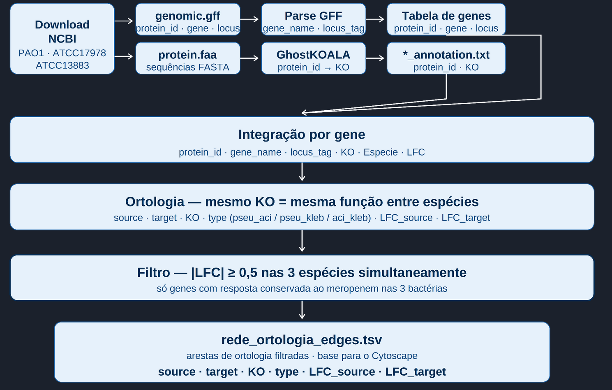
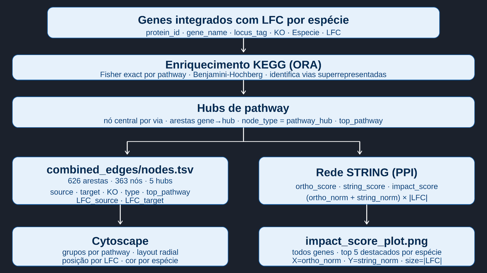
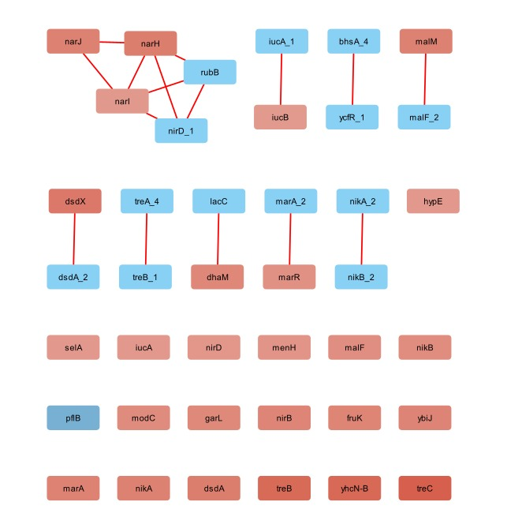
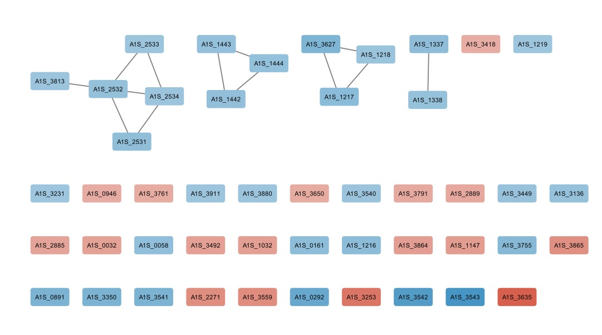
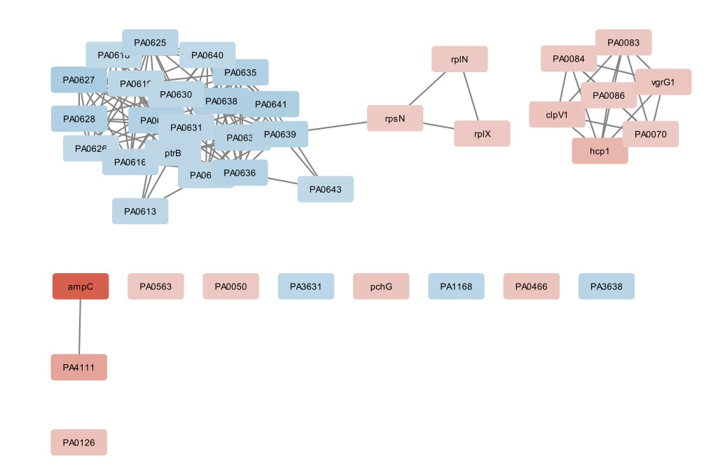
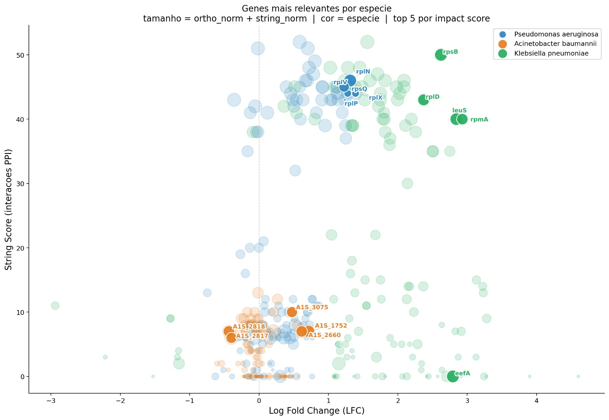

# Projeto `Atlas da Resistência: Análise Comparativa de Redes de Coexpressão Transcriptômica em Patógenos ESKAPE sob Estresse por Carbapenêmicos`


# Project `The Resistance Atlas: Comparative Analysis of Transcriptomic Co-expression Networks in ESKAPE Pathogens under Carbapenem Stress`


# Descrição Resumida do Projeto


O projeto Atlas da Resistência investiga a resposta adaptativa de patógenos do grupo ESKAPE, especificamente *Klebsiella pneumoniae*, *Acinetobacter baumannii* e *Pseudomonas aeruginosa*, quando submetidos ao estresse pelo antibiótico Meropenem. A motivação central reside no fato de que a resistência antimicrobiana não é um evento isolado de um único gene, mas uma propriedade emergente de sistemas biológicos complexos que se organizam para garantir a sobrevivência bacteriana. No contexto clínico atual, essas três bactérias representam as ameaças mais críticas em ambientes hospitalares devido à sua capacidade de "escapar" da ação de carbapenêmicos, que são frequentemente a última linha de defesa terapêutica. O problema abordado pelo projeto é a falta de uma visão sistêmica e comparativa que identifique se diferentes espécies utilizam uma arquitetura de rede comum para resistir ao mesmo fármaco. Utilizando dados de transcriptoma (RNA-Seq) obtidos de bases públicas, o trabalho emprega a Ciência de Redes para transformar níveis de expressão gênica em grafos de coexpressão, onde os genes atuam como nós e suas correlações funcionais como arestas. O objetivo final é realizar uma análise visual e topológica para identificar genes-hub e módulos de resistência conservados, permitindo determinar se existe um "core" transcriptômico universal que possa ser explorado como alvo para novas estratégias de tratamento que ignorem as fronteiras entre espécies.


# Slides 
 
!!! ADICIONAR !!!!
Disponível neste [link]()
- [View slides as PDF]()

# Fundamentação Teórica

A crise global da resistência antimicrobiana (RAM) consolidou-se como um dos maiores desafios da medicina contemporânea, sendo personificada pelo grupo de patógenos denominado ESKAPE (*Enterococcus faecium, Staphylococcus aureus, Klebsiella pneumoniae, Acinetobacter baumannii, Pseudomonas aeruginosa* e *Enterobacter* spp.). Como destacado por Boucher et al. (2009) [^1], o termo "ESKAPE" não se refere apenas à patogenicidade desses microrganismos, mas à sua capacidade intrínseca e adquirida de "escapar" da ação de antibióticos convencionais, limitando drasticamente as opções terapêuticas disponíveis. No topo desta lista de prioridades, a Organização Mundial da Saúde (OMS) classifica *K. pneumoniae*, *A. baumannii* e *P. aeruginosa* como ameaças críticas devido à sua extrema plasticidade genômica e alta prevalência em ambientes de terapia intensiva [^2]. 

A resistência bacteriana manifesta-se quando microrganismos desenvolvem a capacidade de sobreviver e proliferar mesmo sob a exposição a antibióticos projetados para eliminá-los. Esse fenômeno, essencialmente evolutivo, é categorizado em dois eixos principais. O primeiro deles é a resistência intrínseca, que compreende as características naturais e permanentes de uma espécie, a exemplo da membrana externa impermeável das bactérias Gram-negativas ou da ausência congênita do alvo molecular do fármaco. Em contrapartida, a resistência adquirida reflete a plasticidade genômica do patógeno, surgindo por meio de mutações espontâneas ou da transferência horizontal de genes (como o intercâmbio de plasmídeos) entre diferentes colônias. Esse processo de adaptação é drasticamente acelerado pelo uso inadequado de antimicrobianos, que exerce uma pressão seletiva sobre o ambiente e favorece a sobrevivência das cepas mais robustas. O resultado clínico desse ciclo é a conversão de infecções outrora simples em quadros persistentes e complexos, exigindo intervenções terapêuticas mais prolongadas e, frequentemente, de maior toxicidade para o paciente [^3] [^4].

O Relatório GLASS 2025 da Organização Mundial da Saúde (OMS) revelou um cenário crítico, com níveis elevados de resistência em bactérias associadas a infecções de corrente sanguínea, urinárias e respiratórias em todo o mundo. Projeções indicam que, se não houver intervenção, até 10 milhões de pessoas poderão morrer anualmente por infecções bacterianas resistentes até 2050, superando a mortalidade atual por câncer [^4].

O tratamento de infecções graves causadas por esses Gram-negativos frequentemente depende dos carbapenêmicos, como o Meropenem, considerado um fármaco de última linha. O mecanismo de ação do Meropenem baseia-se na inativação das proteínas ligadoras de penicilina (PBPs), enzimas cruciais localizadas na membrana citoplasmática. Ao ligar-se covalentemente a estas proteínas, o fármaco impede a reação de transpeptidação, interrompendo a síntese do peptidoglicano e levando à instabilidade osmótica e lise da célula bacteriana [^5].

Entretanto, a resistência a esses agentes não é um fenômeno estático, mas uma resposta biológica coordenada e dinâmica. Quando expostas ao estresse por carbapenêmicos, as bactérias ativam mecanismos adaptativos que vão além da mera presença de genes de resistência isolados, como o *blaKPC*. Esta resposta envolve a repressão da expressão de porinas (reduzindo a permeabilidade da membrana externa), a ativação de sistemas de efluxo da família RND e uma profunda reorganização do metabolismo energético para sustentar a homeostase celular sob ataque [^6]. Compreender essa interação sistêmica exige ferramentas que capturem o estado fisiológico real do patógeno.

A eficiência do Meropenem é severamente comprometida pela ação de bombas de efluxo da família Resistance-Nodulation-Division (RND), que atuam de forma coordenada e específica em cada patógeno. Na *P. aeruginosa*, o sistema MexAB-OprM destaca-se como o principal determinante da resistência intrínseca aos carbapenêmicos [^7]. Paralelamente, em isolados clínicos de *A. baumannii*, a superexpressão do sistema AdeABC é frequentemente associada ao fenótipo de multirresistência [^8]. Já na *K. pneumoniae*, o sistema AcrAB opera em sinergia com a produção de carbapenemases, reduzindo drasticamente a concentração do fármaco no espaço periplasmático antes que este atinja as proteínas de ligação à penicilina (enzimas bacterianas alvo de antibióticos) [^9].

Nesse contexto, a transcriptômica, através do sequenciamento de RNA (RNA-Seq), surge como uma metodologia revolucionária. Enquanto o genoma oferece o mapa do potencial genético, o transcriptoma revela a resposta biológica em tempo real frente ao estresse antimicrobiano. Por fim, a transição dos dados de expressão gênica para a biologia de sistemas permite uma compreensão holística da resistência. Ao transformar perfis de expressão em grafos, é possível identificar como os genes interagem funcionalmente. Segundo Barabási e Oltvai (2004) [^11], a arquitetura dessas redes é governada por "genes-hub", que são nós altamente conectados que orquestram a resposta celular. A identificação desses hubs e de módulos funcionais conservados entre diferentes espécies de ESKAPE permite localizar o "core" de resistência, fornecendo alvos biológicos promissores para o desenvolvimento de novas estratégias terapêuticas que visem desestabilizar a rede de sobrevivência bacteriana de forma sistêmica [^12].


# Perguntas de Pesquisa

## Pergunta Principal

**Existem mecanismos de resistência ao Meropenem compartilhados entre bactérias ESKAPE?**

## Perguntas Secundárias

1. Quais genes e funções biológicas são diferencialmente regulados em resposta ao Meropenem em cada espécie?

2. Quais ortólogos apresentam comportamento conservado entre *K. pneumoniae*, *A. baumannii* e *P. aeruginosa*?

3. Quais processos biológicos estão enriquecidos entre os genes diferencialmente expressos?

4. Quais genes ocupam posições centrais nas redes biológicas associadas à resistência?

5. Existem vulnerabilidades moleculares compartilhadas que possam ser exploradas como potenciais alvos terapêuticos de amplo espectro?

# Bases de Dados

| Base de Dados                                       | Endereço na Web                                                                                                              | Resumo descritivo                                                                                                                                                                                                                                           |
| :-------------------------------------------------- | :--------------------------------------------------------------------------------------------------------------------------- | :---------------------------------------------------------------------------------------------------------------------------------------------------------------------------------------------------------------------------------------------------------- |
| NCBI GEO – GSE307523 (*Klebsiella pneumoniae*)      | [https://www.ncbi.nlm.nih.gov/geo/query/acc.cgi?acc=GSE307523](https://www.ncbi.nlm.nih.gov/geo/query/acc.cgi?acc=GSE307523) | Dataset de RNA-Seq contendo dados da cepa NK01067. Inclui condições controle (cultivo em caldo de lisogenia) e tratamento com meropenem (8 μg/L), com 3 replicatas por grupo. Utilizado para analisar a resposta transcriptômica da espécie ao antibiótico. |
| NCBI GEO – GSE190441 (*Acinetobacter baumannii*)    | [https://www.ncbi.nlm.nih.gov/geo/query/acc.cgi?acc=GSE190441](https://www.ncbi.nlm.nih.gov/geo/query/acc.cgi?acc=GSE190441) | Dataset de RNA-Seq com amostras em caldo Bushnell-Haas, sob condição controle e tratamento com meropenem. Contém medições em diferentes tempos (30 min, 3h, 9h), sendo selecionado o tempo de 3 horas para padronização, com 3 replicatas por grupo.        |
| NCBI GEO – GSE167137 (*Pseudomonas aeruginosa*)     | [https://www.ncbi.nlm.nih.gov/geo/query/acc.cgi?acc=GSE167137](https://www.ncbi.nlm.nih.gov/geo/query/acc.cgi?acc=GSE167137) | Dataset de RNA-Seq de biofilmes da cepa PAO1. Considera apenas cultura isolada (excluindo co-cultura com *Candida albicans*). Inclui controle e tratamento com meropenem (5 μg/ml), com 4 replicatas por grupo e coleta após 4 horas.                       |
| STRING Database                                     | [https://string-db.org/](https://string-db.org/)                                                                             | Base utilizada para enriquecimento das análises com interações proteína-proteína, permitindo a construção de redes a partir dos genes diferencialmente expressos.                                                                                           |
| KEGG (Kyoto Encyclopedia of Genes and Genomes)      | [https://www.genome.jp/kegg/](https://www.genome.jp/kegg/)                                                                   | Utilizada (planejado) para construção de um dicionário de ortologia entre espécies, permitindo a comparação funcional entre genes de diferentes bactérias.                                                                                                  |
| Comprehensive Antibiotic Resistance Database (CARD) | [https://card.mcmaster.ca/](https://card.mcmaster.ca/)                                                                       | Base de referência para anotação de genes de resistência, auxiliando na interpretação biológica dos genes identificados como hubs nas redes.                                                                                                                |


# Modelo Lógico


> ### **Gene**
>
> Representa cada gene analisado no estudo.
> 
> **Atributos:**
> * **gene\_id (PK):** Identificador único do gene  
> * **nome\_gene:** Nome do gene  
> * **organismo:** Bactéria de origem  
> * **anotacao\_resistencia:** Indica se o gene está associado à resistência (ex: presente no CARD)  
> * **funcao\_biologica:** Função biológica do gene  
> * **amostra\_id:** Identificador da amostra associada  
> * **nivel\_expresao:** Nível de expressão do gene


> ### **Condição Experimental**
> 
> Define o contexto em que as amostras foram coletadas.
> 
> **Atributos:**
> 
> * **amostra\_id:** Identificador da amostra  
> * **antibiotico:** Condição experimental (ex: meropenem ou normal)


> ### **Coexpressão**
> 
> Define a relação associada à expressão gênica em diferentes condições.
> 
> **Atributos:**
> 
> * **gene\_id:** Identificador do gene  
> * **nivel\_expresao\_meropenem:** Nível de expressão sob presença de antibiótico  
> * **nivel\_expresao\_normal:** Nível de expressão em condição normal  
> * **diferenca\_expressao:** Diferença entre os níveis de expressão

> ### **Interações entre Genes** 
> 
> Representa as conexões entre pares de genes/proteínas com base na base STRING, incluindo interações conhecidas e preditas.
> 
> **Atributos:**
> 
> * **gene\_id\_1:** Identificador do primeiro gene  
> * **gene\_id\_2:** Identificador do segundo gene  
> * **score\_interacao:** Score combinado de confiança da interação (0 a 1\)  
> * **tipo\_interacao:** Tipo da interação (ex: experimental, coexpressão, banco de dados, text mining)  
> * **evidencia\_experimental:** Score baseado em experimentos laboratoriais  
> * **evidencia\_coexpressao:** Score baseado em padrões de expressão similares  
> * **evidencia\_textmining:** Score baseado em coocorrência em artigos científicos  
> * **evidencia\_database:** Score baseado em bases curadas


# **Metodologia**




## Quantificação da Resposta ao Meropenem

O pipeline calcula log2 fold change (LFC) para cada espécie usando médias de controle e tratamento:

* **Pseudomonas aeruginosa**: arquivo `pseudo.xlsx`; controle = colunas com `0M`, tratamento = colunas com `5M`.
* **Acinetobacter baumannii**: arquivo `acineto.txt.gz`; réplicas `R1` e `R2` são somadas em cada amostra, controle = colunas `no_mero`, tratamento = colunas `mero`.
* **Klebsiella pneumoniae**: arquivo `kleb.txt.gz`; seleciona colunas `_Count`, controle = `NK01067` sem `MEM`, tratamento = `NK01067` com `MEM`.

O cálculo utilizado é:

```python
LFC = mean(log2(tratamento + 1)) - mean(log2(controle + 1))
```

E o limiar de expressão diferencial é configurável em:

```python
LFC_THRESHOLD = 1.0
```

Genes com `LFC == 0` são descartados da análise.

---

## Integração Genômica

A integração combina três fontes principais:

* Anotações de genes e proteínas do arquivo **GFF**.
* Anotações de função KO a partir de arquivos de mapeamento de proteínas para KEGG Orthology.
* Valores de LFC obtidos a partir dos dados de GEO/contagem.

O script usa `protein_id`, `locus_tag` e `gene_name` para casar as anotações de KO com os valores de LFC de cada organismo.

---

## Ortologia

O código monta uma matriz KEGG de ortologia em que cada linha é um **KO** e cada coluna corresponde a uma espécie. Para cada KO, o gerador apresenta as proteínas associadas àquele KO em cada organismo.

Ausências são registradas como `-`, permitindo comparar diretamente a presença/ausência e a composição de ortólogos entre espécies.

---

## Core Ortólogo DE

A análise identifica o conjunto de KOs que são diferencialmente expressos em todas as espécies analisadas:

* Cada espécie contribui com o conjunto de KOs onde `|LFC| >= LFC_THRESHOLD`.
* O core ortológico é a interseção desses conjuntos entre as três espécies.
* A saída contém genes, LFCs e IDs de proteína por espécie para cada KO conservado.

---

## Enriquecimento Funcional

A análise de pathways utiliza o mapa KEGG de associação KO → pathway:

* O script baixa o conjunto de pathways e os links KO→pathway da API KEGG, ou recarrega um cache local se disponível.
* Executa ORA usando o teste exato de Fisher.
* Aplica correção de múltiplos testes por FDR Benjamini-Hochberg.
* Considera significativos somente pathways com `padj <= 0.05`.

O background é o conjunto de todos os KOs presentes na tabela integrada.

---

## Construção de Redes

O pipeline gera redes de diferentes perspectivas:

* **Rede ortológica**: conecta proteínas de espécies diferentes que compartilham o mesmo KO.
* **Rede core**: subgrafo contendo apenas ortólogos com expressão diferencial compartilhada.
* **Rede de pathways**: integra genes e pathways enriquecidos, destacando KOs associados a pathways significativos.
* **Rede final com hubs**: adiciona nós representando pathways enriquecidos, formando uma estrutura em estrela para facilitar visualização em Cytoscape.

Além disso, o código consulta a base **STRING** para redes de interação proteína-proteína por espécie, calculando métricas de importância como:

* `ortho_score` — número de conexões cross-espécie na rede ortológica.
* `string_score` — número de interações PPI retornadas pela base STRING.
* `impact_score` — combinação normalizada de `ortho_score` e `string_score` multiplicada por `|LFC|`.

O resultado também inclui gráficos e tabelas de top genes por impacto.

---

## Saídas Principais

Os principais arquivos gerados pelo pipeline são:

* `orthologs_integrated.tsv`
* `dicionario_ortologia_kegg.tsv`
* `rede_ortologia_edges.tsv`
* `nodes_metadata.tsv`
* `core_ortologs_DE.tsv`
* `core_edges.tsv`
* `core_nodes.tsv`
* `pathway_enrichment.tsv`
* `pathway_enrichment_plot.png`
* `pathway_edges.tsv`
* `pathway_nodes.tsv`
* `combined_edges.tsv`
* `combined_nodes.tsv`
* `pathway_hub_nodes.tsv`
* `string_pseu_nodes.tsv`, `string_pseu_edges.tsv`
* `string_aci_nodes.tsv`, `string_aci_edges.tsv`
* `string_kleb_nodes.tsv`, `string_kleb_edges.tsv`
* `impact_score_plot.png`
* `top5_impact_genes.tsv`

---


# Resultados

## Manifestação da resistência ao Meropenem

* Cada bactéria apresenta uma **estratégia distinta de resistência**, mas com padrões funcionais recorrentes:

### *Klebsiella pneumoniae*

* 🟥 Ativação de reguladores globais (ex: *marA*)
* 🟥 Proteção osmótica
* 🟦 Ajustes metabólicos e indícios de transição para estados persistentes



### *Acinetobacter baumannii*

* 🟦 Redução da permeabilidade da membrana
* 🟥 Ativação de mecanismos de resposta a dano no DNA (SOS)
* 🟥 Presença de genes altamente conectados ainda não caracterizados



### *Pseudomonas aeruginosa*

* 🟥 Forte ativação de enzimas degradadoras de antibióticos (ex: beta-lactamases)
* 🟥 Ativação de sistemas de competição bacteriana (T6SS)
* 🟦 Repressão de mecanismos que poderiam levar à autodestruição celular



### Rede comdinadas


> Legenda:
> - 🟦 Acinetobacter
> - 🟩 Klebisbella
> - 🟪 Pseudomonas

### Expressão vs. Conectividade



### Discussão
A análise de rede revelou uma alta ortologia (identificada visualmente pelas "bolhas gigantes") entre os genomas de *Klebsiella*, *Pseudomonas* e *Acinetobacter*. No topo dessa topologia biológica, destaca-se o Eixo Ribossomal, caracterizado por uma super-representação massiva das famílias de genes estruturais **rpl** (subunidade 50S) e **rps** (subunidade 30S).

Essa arquitetura evidencia uma fraqueza em comum: independentemente das táticas individuais de virulência de cada espécie, todas dependem criticamente de uma alta taxa de síntese proteica para montar suas respostas defensivas. Como conclusão terapêutica, o modelo valida que a inibição direcionada a esses alvos conservados é a chave para quebrar a resistência de amplo espectro.

O modelo de combate simulado opera em um sistema de duplo impacto:

* **O Ataque Primário:** O uso do beta-lactâmico (Meropenem) atua diretamente na ruptura das PBPs (Penicillin-Binding Proteins), fissurando a integridade da parede celular. Esse estresse mecânico e fisiológico força a bactéria a acionar emergencialmente seu maquinário de defesa sistêmica.  
* **O Golpe Final:** Aproveitando a vulnerabilidade da parede celular desestruturada, ocorre a infiltração massiva dos inibidores de tradução. Uma vez no meio intracelular, eles travam de forma instantânea os alvos ortólogos superexpressos (*rpl/rps*), neutralizando a capacidade de resposta do patógeno.

Contudo, os dados acenderam um alerta vermelho para o *Acinetobacter*. Esta espécie apresenta uma clara **fuga do dogma central** observado nas demais bactérias, desviando-se completamente dos grandes *hubs* hiperconectados da rede. Seus genes de maior *Impact Score* (indicador númeor de interações na rede ortológica e na base STRING), como o *A1S\_3075*, operam de forma isolada na base do gráfico, indicando uma independência estrutural única.  
Essa assinatura reflete uma **tática de guerrilha metabólica**: para sobreviver, o *Acinetobacter* não gasta energia reprogramando grandes complexos proteicos; em vez disso, recruta enzimas autossuficientes e transportadores periféricos, garantindo sua defesa com o menor custo energético possível.

Essa autonomia do *Acinetobacter* gera o **Paradoxo da Entrega**: embora o bloqueio ribossomal seja uma estratégia de amplo espectro poderosa, ele esbarra na impermeabilidade natural da membrana dessa bactéria. A repressão severa de porinas (nó *A1S\_0292/OmpW*) impede que o Meropenem cause a fissura necessária para a entrada dos outros fármacos.  
Para solucionar esse impasse, o desenho terapêutico propõe três etapas sequenciais:

* **Cavalo de Troia:** Substituição do vetor de entrada pelo Cefiderocol (cefalosporina siderófora), que sequestra o sistema de captação de ferro da própria bactéria para penetrar ativamente na célula, ignorando o fechamento das porinas.  
* **Vetor de Ruptura Universal:** Uso combinado de Polimixinas ou Sideróforos para garantir uma ação mecânica de quebra de barreira que independe inteiramente de porinas ou de enzimas de resistência.  
* **Bloqueio Ortólogo e Colapso Final:** Com as vias de acesso liberadas, os inibidores de tradução ligam-se irreversivelmente aos genes *rpl/rps*. Ao travar o maquinário de síntese proteica universal, o sistema induz a falência total das estratégias espécie-especificas: o escudo de trealose é perdido, o sistema de secreção Tipo VI (T6SS) é desativado e as bombas de efluxo entram em colapso definitivo.


## Próximos passos

* **Validação** - Edição via CRISPR-Cas: Provar a causalidade através do nocaute direcional dos hubs isolados (ex: cefA ou A1S_3075).
* **Sinergismo** - Checkerboard Assay: Cálculo do Índice FIC entre agentes de ruptura (Polimixinas) e inibidores ribossomais.
* **In Vivo** - Modelos de Infecção: Ensaios de sobrevida em Galleria mellonella ou murinos para avaliar eficácia clínica.

---

# Ferramentas

* **Python (Pandas, NumPy):** processamento e análise de dados
* **NCBI GEO:** obtenção dos datasets
* **STRING DB:** construção inicial de redes de interação
* **KEGG API:** construção do dicionário de ortologia


---


# Referências Bibliográficas

[^1]: Boucher HW, Talbot GH, Bradley JS, Edwards JE, Gilbert D, Rice LB, et al. Bad bugs, no drugs: no ESKAPE\! An update from the Infectious Diseases Society of America. Clin Infect Dis. 1o de janeiro de 2009;48(1):1–12. doi:10.1086/595011 PubMed PMID: 19035777\.  
[^2]: Tacconelli E, Carrara E, Savoldi A, Harbarth S, Mendelson M, sMonnet DL, et al. Discovery, research, and development of new antibiotics: the WHO priority list of antibiotic-resistant bacteria and tuberculosis. Lancet Infect Dis. março de 2018;18(3):318–27. doi:10.1016/S1473-3099(17)30753-3 PubMed PMID: 29276051\.  
[^3]: Blair JMA, Webber MA, Baylay AJ, Ogbolu DO, Piddock LJV. Molecular mechanisms of antibiotic resistance. Nat Rev Microbiol. janeiro de 2015;13(1):42–51. doi:10.1038/nrmicro3380  
[^4]: MOBIUS LIFE SCIENCE. Resistência antimicrobiana: a pandemia silenciosa que ameaça a saúde global. Mobius Life Science \[Internet\]. S.D. \[citado 22 de março de 2026\]. Disponível em: https://mobiuslife.com.br/blog/resistencia-antimicrobiana-a-pandemia-silenciosa-que-ameaca-a-saude-global/  
[^5]: Papp-Wallace KM, Endimiani A, Taracila MA, Bonomo RA. Carbapenems: Past, Present, and Future ▿. Antimicrob Agents Chemother. novembro de 2011;55(11):4943–60. doi:10.1128/AAC.00296-11 PubMed PMID: 21859938; PubMed Central PMCID: PMC3195018.  
[^6]: Zeng X, Lin J. Beta-lactamase induction and cell wall metabolism in Gram-negative bacteria. Front Microbiol. 2013;4:128. doi:10.3389/fmicb.2013.00128 PubMed PMID: 23734147; PubMed Central PMCID: PMC3660660.  
[^7]: Li XZ, Plésiat P, Nikaido H. The challenge of efflux-mediated antibiotic resistance in Gram-negative bacteria. Clin Microbiol Rev. abril de 2015;28(2):337–418. doi:10.1128/CMR.00117-14 PubMed PMID: 25788514; PubMed Central PMCID: PMC4402952.  
[^8]: Coyne S, Courvalin P, Périchon B. Efflux-Mediated Antibiotic Resistance in Acinetobacter spp. Antimicrob Agents Chemother. março de 2011;55(3):947–53. doi:10.1128/AAC.01388-10 PubMed PMID: 21173183; PubMed Central PMCID: PMC3067115.  
[^9]: Padilla E, Llobet E, Doménech-Sánchez A, Martínez-Martínez L, Bengoechea JA, Albertí S. Klebsiella pneumoniae AcrAB Efflux Pump Contributes to Antimicrobial Resistance and Virulence. Antimicrob Agents Chemother. janeiro de 2010;54(1):177–83. doi:10.1128/AAC.00715-09 PubMed PMID: 19858254; PubMed Central PMCID: PMC2798511.  
[^10]: Wang Z, Gerstein M, Snyder M. RNA-Seq: a revolutionary tool for transcriptomics. Nat Rev Genet. janeiro de 2009;10(1):57–63. doi:10.1038/nrg2484 PubMed PMID: 19015660; PubMed Central PMCID: PMC2949280.  
[^11]: Barabási AL, Oltvai ZN. Network biology: understanding the cell’s functional organization. Nat Rev Genet. fevereiro de 2004;5(2):101–13. doi:10.1038/nrg1272  
[^12]: Langfelder P, Horvath S. WGCNA: an R package for weighted correlation network analysis. BMC Bioinformatics. 29 de dezembro de 2008;9:559. doi:10.1186/1471-2105-9-559 PubMed PMID: 19114008; PubMed Central PMCID: PMC2631488.
